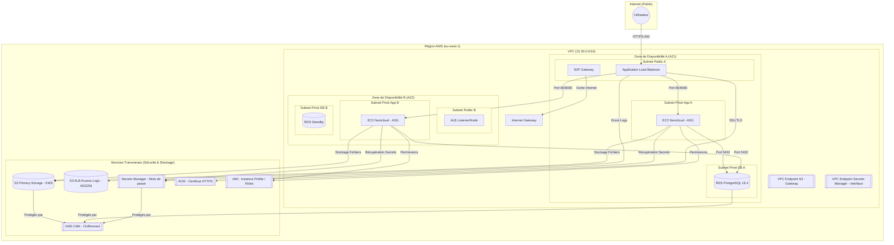

# RENDU — TP05 — Nextcloud sur AWS

> **Instructions de remplissage** : ce fichier est le `docs/RENDU.md` à livrer dans votre zip. Copiez-le tel quel dans votre repo à la racine de `docs/RENDU.md`, puis remplissez **toutes** les sections ci-dessous. Les `<!-- remplir ici -->` et les `TODO` doivent avoir disparu à la remise.

---

## 🟥 Rappel critique — avant de zipper

> 🟥 **Ne jamais committer** :
>
> - `*.tfvars` (sauf les `*.tfvars.example`)
> - `*.tfstate` et `*.tfstate.backup`
> - Le dossier `.terraform/`
> - Aucun mot de passe en clair (DB, admin Nextcloud, clé AWS, token GitHub)
> - Aucune clé privée (`*.pem`, `id_rsa`, etc.)
>
> 🔹 Vérifiez une dernière fois avant le zip :
>
> ```bash
> cd tp05-nextcloud
> grep -rE "(password|secret|AKIA)" --include="*.tf" --include="*.tfvars" . | grep -v example
> # Doit retourner 0 ligne
> ```

---

## Section 1 — Identification de l'équipe

**Numéro d'équipe** : Equipe 5
**Nom de code de l'équipe** *(optionnel)* : MTP
**Date de rendu** : 2026-04-16

### Membres

| Prénom Nom | Rôle assigné | Email | Compte GitHub |
|------------|--------------|-------|---------------|
| BAIGET Quentin| Platform Lead (Rôle 1) | q.baiget@ecole-ipssi.net | @Winteller-Adm |
| CAVAILLÉ Cédric  | Network Engineer (Rôle 2) | c.cavaille@ecole-ipssi.net | @AlmaFolcolmiac |
| JAEN Pierre | Compute Engineer (Rôle 3) |p.jaen@ecole-ipssi.net |@peter0809 |
| Dzamshed KHUSEYNOV | Data Engineer (Rôle 4) | d.khuseynov@ecole-ipssi.net |@dfrank18 |
| CAVAILLÉ Cédric| Security Engineer (Rôle 5) | c.cavaille@ecole-ipssi.net | @AlmaFolcolmiac |

> 🔷 Équipe à 4 personnes : indiquez qui a fusionné le rôle Security dans le rôle Platform.
>
> Equipe de 4 personnes : CAVAILLÉ Cédric a fusionné le rôle Réseau et Sécurity.

## Section 2 — Résumé architecture

**En 5 lignes maximum**, décrivez l'infrastructure déployée (couches, AZ, interactions principales).

VPC 10.30.0.0/16 sur 2 AZ (Paris) avec 6 subnets segmentés par rôle. Un ALB public gère le flux HTTPS (certificat RSA 4096) vers un ASG d'instances EC2 privées exécutant Nextcloud via Docker. La persistance est assurée par une instance RDS PostgreSQL isolée et un bucket S3 chiffré par une clé KMS dédiée.

### Schéma Mermaid (à jour avec ce qui a été réellement déployé)


 
> 🔹 Astuce : copiez le schéma du fichier `ARCHITECTURE.md` que vous avez maintenu pendant la journée.

---

## Section 3 — Arbitrages techniques réalisés

Listez **au minimum 3 arbitrages** que vous avez faits pendant le TP (choix structurant, alternative considérée, raison du choix, conséquence).

### Arbitrage 1

- **Choix retenu** : Activation de drop_invalid_header_fields = true sur l'ALB
- **Alternative envisagée** : Laisser la valeur par défaut 
- **Raison** : Cela protège l'application contre les attaques de type HTTP en filtrant les en-têtes malformés dès l'entrée de l'infrastructure 
- **Conséquence / limite** : Nécessite des clients HTTP standards et propres. Si une application legacy envoyait des headers non conformes, ils seraient bloqués par l'ALB.


### Arbitrage 2

- **Choix retenu** : Utilisation d'une clé RSA de 4096 bits pour le certificat TLS auto-signé. 
- **Alternative envisagée** : Utiliser une clé de 2048 bits.
- **Raison** : Standard de durcissement (Hardening). Bien que 2048 bits soit encore considéré comme sûr, le passage à 4096 bits est une pratique de GRC pour garantir une résistance accrue à long terme face à l'augmentation des capacités de calcul. 
- **Conséquence / limite** : Une très légère augmentation de la charge CPU lors du "handshake" TLS initial, mais négligeable pour une plateforme Nextcloud de cette taille. 


### Arbitrage 3

- **Choix retenu** : Utilisation d'un workflow basé sur des Pull Requests (PR) pour fusionner les changements des modules vers la branche main.
- **Alternative envisagée** : Travailler et "pusher" directement sur la branche main (Trunk-based development sans contrôle).
- **Raison** : La PR est un point de contrôle (Check Point) essentiel. Elle permet d'effectuer une revue de code, de vérifier la conformité (via des outils comme tfsec ou terraform validate) avant que l'infrastructure ne soit modifiée. Cela garantit l'intégrité de la branche principale.
- **Conséquence / limite** : Cela demande une étape supplémentaire (le merge sur l'interface puis le git pull en local). Comme on l'a vu, si on oublie de synchroniser son environnement local après le merge, on risque de travailler sur une version obsolète.

---

## Section 4 — Retour sur les interfaces inter-modules

Les interfaces (variables + outputs) étaient figées au kick-off. Répondez aux questions suivantes.

**Quelle interface a été la plus délicate à stabiliser ?**

Les interfaces IG et Subnet App, à cause des droits sur les compte et des erreurs dans les documents fourni.

**Avez-vous dû modifier une interface en cours de route ? Si oui, laquelle et pourquoi ?**

> Ajout des variable var.s3_primary_bucket_arn et changement des variable et string région.

**Qu'est-ce qui a le mieux fonctionné dans la collaboration inter-modules ?**

Le fait d'utilisé Github pour les merge et la cohésion d'équipe.

**Qu'est-ce qui a bloqué ?**

Les informations flou, les dissonnances entre les demandes réel et les informations apporté, et le manque de droit sur le tenant AWS.

---

## Section 5 — Résultats `terraform plan` et `terraform apply`

Collez ici les **résumés** (pas les sorties complètes) des commandes finales exécutées depuis `envs/dev/`.

### `terraform plan` final

```text
Plan: 72 to add, 0 to change, 0 to destroy.
 
Changes to Outputs:
  + admin_password_secret_arn = (known after apply)
  + alb_dns_name              = (known after apply)
  + asg_name                  = "kolab-dev-asg"
  + db_endpoint               = (known after apply)
  + db_password_secret_arn    = (known after apply)
  + nextcloud_url             = (known after apply)
  + s3_logs_bucket_name       = (known after apply)
  + s3_primary_bucket_name    = (known after apply)
  + vpc_id                    = (known after apply)
```

### `terraform apply` final

```text
Plan: 72 to add, 0 to change, 0 to destroy.
 
Changes to Outputs:
  + admin_password_secret_arn = (known after apply)
  + alb_dns_name              = (known after apply)
  + asg_name                  = "kolab-dev-asg"
  + db_endpoint               = (known after apply)
  + db_password_secret_arn    = (known after apply)
  + nextcloud_url             = (known after apply)
  + s3_logs_bucket_name       = (known after apply)
  + s3_primary_bucket_name    = (known after apply)
  + vpc_id                    = (known after apply)
```

### Nombre total de ressources déployées

**Total** : `72` ressources

> 🔷 Ce nombre doit correspondre à ce qui est visible dans `02-apply-success.png`.

---

## Section 6 — Checklist des 5 screenshots obligatoires

Les captures doivent être dans `docs/screenshots/` au format PNG. Cochez chaque case quand le fichier est présent ET lisible.

- [X] `01-plan-dev.png` — sortie de `terraform plan` avec la ligne `Plan: N to add, ...` visible
- [X] `02-apply-success.png` — sortie `Apply complete! Resources: N added.` + les outputs visibles
- [ ] `03-nextcloud-login.png` — page de login Nextcloud dans le navigateur avec l'URL ALB visible dans la barre d'adresse
- [ ] `04-file-in-s3.png` — console AWS S3 montrant un fichier uploadé depuis Nextcloud, avec le chiffrement KMS visible dans les propriétés
- [X] `05-destroy-success.png` — sortie `Destroy complete! Resources: N destroyed.`

> 🟡 Piège courant : les screenshots avec informations sensibles visibles. Avant de les coller dans le zip, floutez les IP publiques personnelles, les tokens, les clés AWS complètes.

> 🔹 Astuce : si une capture contient un mot de passe admin Nextcloud en clair (généré puis affiché), régénérez-la avec le mot de passe masqué ou ne l'incluez pas.

---

## Section 7 — Coût estimé

Estimez le coût de l'infrastructure pour 24h de fonctionnement (dev). Utilisez Infracost si possible, sinon faites un calcul manuel à partir de la [page de tarification AWS eu-west-1](https://aws.amazon.com/ec2/pricing/on-demand/).

| Ressource | Quantité | Prix unitaire (USD) | Sous-total 24h (USD) |
|-----------|----------|---------------------|----------------------|
| EC2 t3.small | 2 | 0.0226 / h | 1.08$ |
| ALB | 1 | 0.0252 / h | 0.60$ |
| NAT Gateway | 1 | 0.048 / h | 1.15$ |
| RDS db.t3.micro Multi-AZ | 1 | 0.038 / h | 0.91$ |
| EBS RDS gp3 | 20 GB | 0.096 / GB-mois | 0.06$ |
| S3 primary + logs | 10 GB | 0.023 / GB-mois | 0.01$ |
| KMS CMK | 1 | 1.0 / mois | 0.03$ |
| Secrets Manager | 2 | 0.40 / secret / mois | 0.03 $ |
| VPC Endpoints |  2 | 0.011 / h | 0.53 $ |
| **Total 24h** | | | ~4.40$ |
| **Extrapolation 30 jours** | | | ~132.39$ |


---

## Section 8 — Rétrospective équipe

### 🟢 3 choses qui ont bien marché

1. S3 mis en place
2. Groupe de sécurité fonctionnel
3. Le fait de travailler chacun dans un module diférent 


### 🔴 3 choses qui ont bloqué

1. Manque de droits
2. Les création vpc et EC2 se marché dessus entre groupe
3. Test impossible

### 🔷 3 améliorations pour la prochaine fois

1. Utilisation de Tenant Etudiant
2. Amélioration Repo Git
3. Apprentissage plus approfondie de la solution


---

## Section 9 — Contribution individuelle par rôle

**Chaque membre remplit son bloc lui-même.** Soyez honnêtes — cette section sert à l'individualisation de la note.

> 🔷 Le hash du commit est obtenu avec `git log --oneline -1 --author="Votre Nom"` ou `git log --format='%h %s' | head -5`.

---

### Rôle 1 — Platform Lead

**Membre** : Quentin Baiget

**Ce que j'ai livré** :

- bootstrap/create-state-bucket.sh
- envs/dev/backend.tf + providers.tf
- envs/dev/variables.tf + terraform.tfvars
- envs/dev/main.tf
- revue de certaines PRs
- orchestration du terraform apply collectif

**Ce qui m'a surpris ou frustré** :

> La compléxité de mise en place d'une réelle solution. Les TP étaient assez facilement compréhensible et le décallage avec un cas proche du réel est assez marquant.

**Ce que j'ai appris** :

> La mise en place d'un script bootstrap afin de gérer un bucket et s'en servir pour créer une CMK c'est quelque chose dont je savais que c'était utilisé mais je n'avais jamais pu la mettre en place jusqu'a maintenant.

**Hash du dernier commit significatif que j'ai fait** : `1682070`

---

### Rôle 2 — Network Engineer

**Membre** : Cédric CAVAILLÉ

**Ce que j'ai livré** :

- `<!-- ex: modules/networking/main.tf — VPC + 6 subnets + IGW + NAT -->`
- `<!-- ex: route tables publiques et privées avec associations -->`
- `<!-- ex: VPC endpoints Gateway S3 + Interface Secrets Manager -->`
- `<!-- ex: outputs vpc_id, public_subnet_ids, private_app_subnet_ids, private_db_subnet_ids -->`
- `<!-- ex: README.md du module généré via terraform-docs -->`

**Ce qui m'a surpris ou frustré** :

> 

<!-- remplir ici -->

**Ce que j'ai appris** :

<!-- remplir ici -->

**Hash du dernier commit significatif que j'ai fait** : dfde28344ed7b47d85663797f3c9e9e4943f43ec

---

### Rôle 3 — Compute Engineer

**Membre** : Pierre JAEN

**Ce que j'ai livré** :

- modules/compute/alb.tf — ALB + TG + listener HTTPS self-signed
- modules/compute/asg.tf — launch template + ASG single
- templates/nextcloud-user-data.sh.tftpl — script Docker run Nextcloud 
- outputs alb_dns_name, nextcloud_url, asg_name

**Ce qui m'a surpris ou frustré** :

> La complexité du chaînage des variables entre les modules m'a marqué. Terraform est très strict : si un output du module "Security" n'est pas correctement relié à l'input du module "Compute" dans le fichier racine, le plan échoue ou repasse en mode interactif. Il faut être extrêmement rigoureux sur le nommage.

**Ce que j'ai appris** :

> J'ai appris à transformer des recommandations d'audit (findings tfsec) en code concret (Hardening).

**Hash du dernier commit significatif que j'ai fait** : 3b1c0a8

---

### Rôle 4 — Data Engineer

**Membre** : Dzamshed KHUSEYNOV

**Ce que j'ai livré** :

- `<!-- modules/data/main.tf — Date sources & RandomID `
- `<!-- modules/data/rds.tf — RDS PG Multi-AZ, subnet group, parameter group`
- `<!-- modules/data/s3.tf — bucket primary + bucket logs avec SSE-KMS, block public, versioning, bucket policy ALB`

**Ce qui m'a surpris ou frustré** :

> Les erreurs au moment du terraform apply qui correspondaient aux variables non déclarés m'ont appris a diagnostiquer et comprendre davantage les fichiers de configurations terraform.

**Ce que j'ai appris** :

> J'ai appris up peu près a visualiser les différentes éléments dans une infra AWS. De plus j'ai comprends mieux l'organisation des  différents ressources. Signification des différents fichiers de configuration terraform.

**Hash du dernier commit significatif que j'ai fait** : d781ee2dd614db2586ccf83d60cc3da352d95671

---

### Rôle 5 — Security Engineer

**Membre** : N/A équipe à 4, fusionné avec Rôle 2

**Ce que j'ai livré** :

- `<!-- ex: modules/security/sg.tf — 3 SG (alb, app, db) avec aws_vpc_security_group_ingress_rule v5 -->`
- `<!-- ex: modules/security/kms.tf — CMK + alias + rotation activée -->`
- `<!-- ex: modules/security/iam.tf — IAM role EC2 + instance profile + policies scoped S3/Secrets -->`
- `<!-- ex: modules/security/secrets.tf — 2 secrets (db_password, admin_password) générés via random_password -->`

**Ce qui m'a surpris ou frustré** :

<!-- remplir ici -->

**Ce que j'ai appris** :

<!-- remplir ici -->

**Hash du dernier commit significatif que j'ai fait** : 2e1bb62aba4b59ede628110232bcbc554e4985bf

---

## Section 10 — Checklist finale avant remise

**L'équipe certifie collectivement que** :

- [X] `terraform destroy` a été exécuté avec succès dans `envs/dev/` (screenshot `05-destroy-success.png` prouve `Destroy complete!`)
- [X] La console AWS a été re-vérifiée : aucune EC2, RDS, NAT Gateway, ELB, EIP, Secret Manager, bucket S3 (hors bucket state) ne reste avec les tags de l'équipe
- [X] Aucun fichier `*.tfstate` ou `*.tfstate.backup` n'est présent dans le zip
- [X] Aucun dossier `.terraform/` n'est présent dans le zip
- [X] Aucun fichier `*.tfvars` personnel n'est présent (seul `terraform.tfvars.example` est autorisé)
- [X] Aucun secret en clair (mot de passe DB, admin, access key, token GitHub) n'est dans le code
- [ ] La commande `grep -rE "(password|secret|AKIA)" --include="*.tf" . | grep -v example` retourne 0 ligne
- [ ] Les 5 screenshots obligatoires sont dans `docs/screenshots/`
- [X] Le fichier `docs/RENDU.md` (ce fichier) est rempli à 100 % — plus aucun `<!-- remplir -->` ni `TODO` résiduel
- [X] Le fichier `ARCHITECTURE.md` contient un schéma Mermaid à jour
- [X] Chaque module dans `modules/` a son `README.md` (minimum : titre + description + inputs/outputs)
- [X] Le fichier `.terraform.lock.hcl` est committé (mais pas `.terraform/`)
- [X] Les commits git sont tracés par auteur (pour la notation individuelle)
- [X] Le zip est nommé exactement `tp05-nextcloud-equipe<N>.zip`

### Commande de packaging recommandée

```bash
# Depuis la racine du projet
cd ~/formation-terraform/jour5

# Nettoyage des artefacts lourds avant zip
find tp05-nextcloud -type d -name ".terraform" -exec rm -rf {} +
find tp05-nextcloud -name "terraform.tfstate*" -delete
find tp05-nextcloud -name "*.tfvars" ! -name "*.tfvars.example" -delete

# Verification finale secrets
grep -rE "(password|secret|AKIA)" tp05-nextcloud --include="*.tf" --include="*.tfvars" | grep -v example
# Doit retourner 0 ligne

# Zip final (en conservant le .git pour la notation individuelle)
zip -r tp05-nextcloud-equipe<N>.zip tp05-nextcloud/

# Verification du contenu
unzip -l tp05-nextcloud-equipe<N>.zip | head -50
```

---

## Signature de l'équipe

**Date de remise** : 2026/04/16 HH:MM

**Signataires** (tous les membres doivent cocher) :

- [X] `<!-- Quentin Baiget Rôle 1 -->` — certifie l'exactitude des informations ci-dessus
- [X] `<!-- Cédric CAVAILLÉ Rôle 2 -->` — certifie l'exactitude des informations ci-dessus
- [X] `<!-- Pierre Jaen Rôle 3 -->` — certifie l'exactitude des informations ci-dessus
- [X] `<!-- Prénom Nom Rôle 4 -->` — certifie l'exactitude des informations ci-dessus
- [X] `<!-- Cédric CAVAILLÉ Rôle 5 -->` — certifie l'exactitude des informations ci-dessus

> 🟢 Bravo — vous avez livré une infrastructure de production réelle en équipe. C'est exactement ce que vous ferez en entreprise. Bon courage pour la suite.
